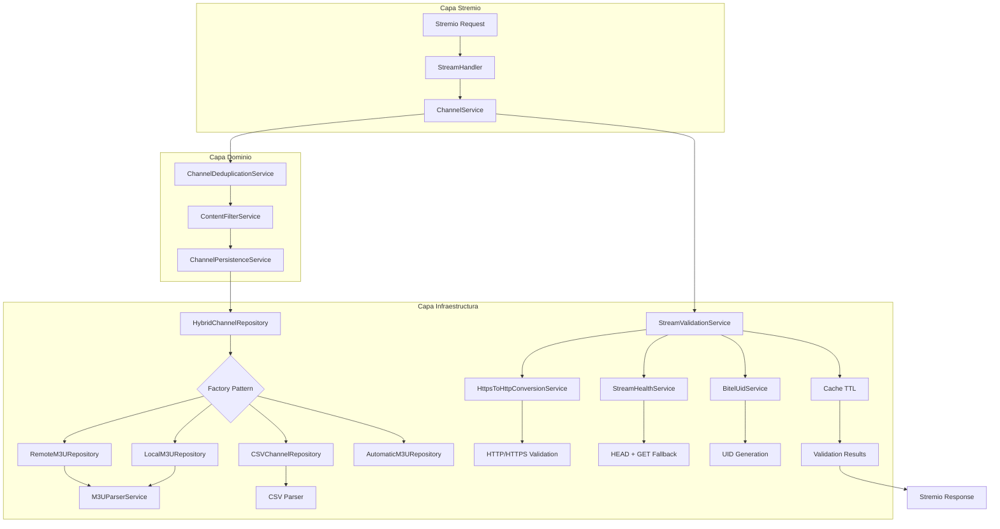
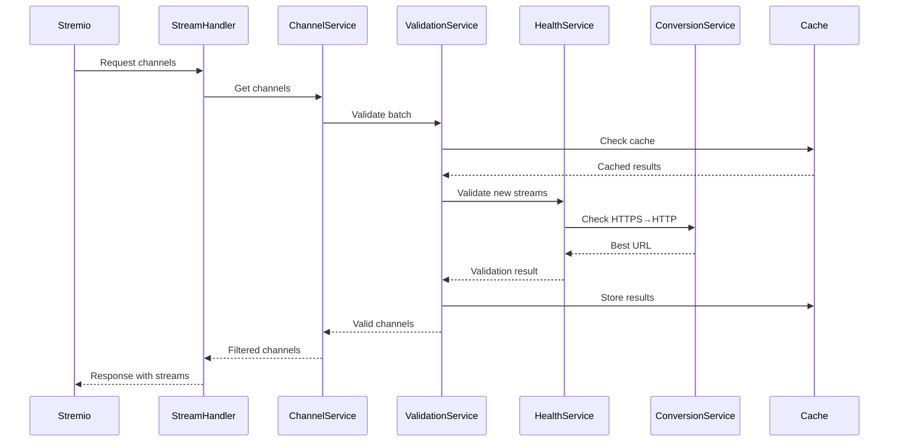

# 📺 TV IPTV Addon para Stremio - Documentación Técnica

## 📋 Índice

1. [Visión General](#visión-general)
2. [Arquitectura del Sistema](#arquitectura-del-sistema)
3. [Flujo de Datos](#flujo-de-datos)
4. [Componentes Principales](#componentes-principales)
5. [Sistema de Validación de Streams](#sistema-de-validación-de-streams)
6. [Servicios de Infraestructura](#servicios-de-infraestructura)
7. [Configuración](#configuración)
8. [Manejo de Errores](#manejo-de-errores)
9. [Seguridad](#seguridad)
10. [Despliegue](#despliegue)

## 🎯 Visión General

El **TV IPTV Addon** es una extensión para Stremio que proporciona acceso a canales de televisión en vivo desde fuentes IPTV. Implementa arquitectura limpia con validación robusta de streams.

### Características Principales
- ✅ Validación multi-etapa de streams HTTP/HTTPS
- ✅ Validación pre-filtrado de conectividad de canales
- ✅ Análisis de canales removidos por filtros inteligentes
- ✅ Validación post-filtrado para garantizar calidad final
- ✅ Conversión automática HTTPS→HTTP
- ✅ Cache de validación con TTL configurable
- ✅ Procesamiento por lotes concurrente
- ✅ Sistema de filtros de contenido avanzado
- ✅ Manejo robusto de errores y reintentos
- ✅ Deduplicación inteligente de canales
- ✅ Generación dinámica de UIDs para BITEL
- ✅ Sistema híbrido de fuentes (CSV + M3U)

## 🏗️ Arquitectura del Sistema

### Diagrama de Arquitectura Completa

```
┌─────────────────────────────────────────────────────────────────────────────────────────────┐
│                                   STREMIO ADDON LAYER                                        │
├─────────────────────────────────────────────────────────────────────────────────────────────┤
│  ┌─────────────────┐    ┌─────────────────┐    ┌─────────────────┐    ┌─────────────────┐  │
│  │   Stremio API   │────│  StreamHandler  │────│  ChannelService │────│InvalidChannel   │  │
│  └─────────────────┘    └─────────────────┘    └─────────────────┘    │ManagementService│  │
│                                                                      └─────────────────┘  │
├─────────────────────────────────────────────────────────────────────────────────────────────┤
│                                   DOMAIN LAYER                                              │
├─────────────────────────────────────────────────────────────────────────────────────────────┤
│  ┌─────────────────┐    ┌─────────────────┐    ┌─────────────────┐    ┌─────────────────┐  │
│  │     Channel     │    │ ContentFilter   │    │ChannelPersistence│    │ChannelDedupli-  │  │
│  │     Entity      │    │    Service      │    │    Service       │    │cationService    │  │
│  └─────────────────┘    └─────────────────┘    └─────────────────┘    └─────────────────┘  │
├─────────────────────────────────────────────────────────────────────────────────────────────┤
│                                 INFRASTRUCTURE LAYER                                        │
├─────────────────────────────────────────────────────────────────────────────────────────────┤
│  ┌─────────────────┐    ┌─────────────────┐    ┌─────────────────┐    ┌─────────────────┐  │
│  │StreamValidation  │    │StreamHealth     │    │HttpsToHttp      │    │   BitelUid      │  │
│  │    Service      │    │   Service       │    │Conversion       │    │   Service       │  │
│  └─────────────────┘    └─────────────────┘    │    Service      │    └─────────────────┘  │
│                                                └─────────────────┘                         │
│  ┌─────────────────┐    ┌─────────────────┐    ┌─────────────────┐    ┌─────────────────┐  │
│  │HybridChannel    │    │RemoteM3U        │    │LocalM3U         │    │   CSVChannel    │  │
│  │ Repository      │    │ Repository      │    │ Repository      │    │  Repository     │  │
│  └─────────────────┘    └─────────────────┘    └─────────────────┘    └─────────────────┘  │
│                                                                                             │
│  ┌─────────────────┐    ┌─────────────────┐    ┌─────────────────┐    ┌─────────────────┐  │
│  │   M3UParser     │    │SecurityMiddleware│   │ ErrorHandler    │    │ChannelRepository│  │
│  │    Service      │    │                 │   │                  │    │    Factory      │  │
│  └─────────────────┘    └─────────────────┘    └─────────────────┘    └─────────────────┘  │
└─────────────────────────────────────────────────────────────────────────────────────────────┘
```

### Principios SOLID
- **S**: Cada servicio tiene responsabilidad única
- **O**: Extensible mediante nuevos repositorios/filtros
- **L**: Interfaces bien definidas para todos los componentes
- **I**: APIs específicas para cada caso de uso
- **D**: Inyección de dependencias en constructores

## 🔄 Flujo de Datos Detallado

### 1. Inicialización del Sistema
```
index.js
    ↓
TVAddonConfig (env vars)
    ↓
ChannelRepositoryFactory
    ↓
HybridChannelRepository
    ↓
ContentFilterService
    ↓
StreamValidationService
```

### 2. Flujo de Validación de Streams
```
Channel → StreamValidationService → HttpsToHttpConversionService → StreamHealthService
   ↓              ↓                        ↓                         ↓
Cache Check → Quick HEAD → HTTPS/HTTP Test → Final Validation → Result Cache
```

### 3. Procesamiento por Lotes
```
Batch Input → Concurrent Workers → Individual Validation → Statistics → Cache Update
```

## 🔍 Funcionamiento Interno Detallado

### Flujo de Datos Completo



### Componentes Internos Detallados

#### 1. StreamValidationService - Validador Principal

**Responsabilidad**: Validación temprana de streams con cache y métricas.

**Flujo Interno**:
```javascript
// Flujo de validación
1. Recibe canal → 2. Verifica cache → 3. HEAD request → 4. Fallback HTTPS → 5. HTTP conversion → 6. Actualiza cache → 7. Retorna resultado
```

**Métodos Clave**:
- `#quickValidation(url)`: HEAD request con timeout progresivo
- `#validateChannelsBatch(channels)`: Procesamiento concurrente por lotes
- `#getCachedResult(url)`: Recuperación TTL de resultados previos
- `#setCachedResult(url, result)`: Almacenamiento con cleanup automático

**Configuración**:
```javascript
{
  timeout: 5000ms,
  maxRedirects: 3,
  retries: 2,
  cacheTtl: 3600000ms,
  maxCacheSize: 10000
}
```

#### 2. StreamHealthService - Monitor de Salud

**Responsabilidad**: Verificación profunda de disponibilidad de streams.

**Mecanismo de Validación**:
```javascript
// Estrategia de reintentos
Intento 1: HEAD request (timeout 5s)
Intento 2: HEAD request (timeout 10s) 
Intento 3: Partial GET request (primeros 1024 bytes)
```

**Manejo de Errores**:
- **ECONNREFUSED**: Marca como no disponible
- **ETIMEDOUT**: Reintento con backoff exponencial
- **ENOTFOUND**: DNS inválido
- **HTTP 4xx/5xx**: Análisis específico por código

#### 3. HttpsToHttpConversionService - Conversión Inteligente

**Responsabilidad**: Detecta y convierte HTTPS→HTTP cuando es beneficioso.

**Lógica de Conversión**:
```javascript
// Proceso de conversión
1. Valida HTTPS original → 2. Genera URL HTTP → 3. Valida versión HTTP → 4. Compara resultados → 5. Retorna mejor opción
```

**Estadísticas de Conversión**:
- Total de canales procesados
- Conversión exitosa/fallida
- Streams funcionando mejor en HTTP
- Streams que requieren HTTPS

#### 4. BitelUidService - Generador de Identificadores

**Responsabilidad**: Genera UIDs únicos para integración con BITEL.

**Algoritmo de Generación**:
```javascript
// Estructura del UID
[PREFIX]-[HASH_BASE64]-[TIMESTAMP]
- Prefix: 'BITEL' fijo
- Hash: SHA256 de URL + nombre + país
- Timestamp: Unix timestamp
```

**Ejemplo**:
```
BITEL-a1b2c3d4-1699564800
```

#### 5. HybridChannelRepository - Repositorio Unificado

**Responsabilidad**: Gestiona múltiples fuentes de canales transparentemente.

**Fuentes Soportadas**:
- **RemoteM3URepository**: URLs remotas M3U/M3U8
- **LocalM3URepository**: Archivos locales M3U/M3U8
- **CSVChannelRepository**: Archivos CSV con metadata
- **AutomaticM3URepository**: Descarga automática y cache

**Proceso de Carga**:
```javascript
1. Factory selecciona repositorio según URL
2. ParserService extrae canales
3. DeduplicationService elimina duplicados
4. ContentFilterService aplica filtros
5. PersistenceService almacena temporalmente
```

#### 6. M3UParserService - Parser de M3U

**Responsabilidad**: Parsea archivos M3U/M3U8 con soporte para extinf metadata.

**Formatos Soportados**:
```m3u
#EXTM3U
#EXTINF:-1 tvg-logo="logo.png" group-title="Categoria",Nombre Canal
http://ejemplo.com/stream.m3u8
```

**Campos Extraídos**:
- Nombre del canal
- URL del stream
- Logo (tvg-logo)
- Categoría (group-title)
- ID de canal (tvg-id)

#### 7. SecurityMiddleware - Seguridad de Peticiones

**Responsabilidad**: Valida y sanitiza todas las peticiones entrantes.

**Capas de Seguridad**:
1. **Rate Limiting**: Límite de peticiones por IP
2. **Input Validation**: Sanitización de parámetros
3. **CORS**: Control de orígenes permitidos
4. **Headers Security**: Headers de seguridad HTTP

#### 8. ChannelDeduplicationService - Eliminación de Duplicados

**Responsabilidad**: Identifica y elimina canales duplicados manteniendo el mejor.

**Criterios de Deduplicación**:
- URLs idénticas
- Nombres similares (95% coincidencia)
- Misma categoría y país
- Prioriza streams validados

#### 9. ContentFilterService - Filtros de Contenido

**Responsabilidad**: Filtra canales según criterios configurables.

**Filtros Disponibles**:
- Por país
- Por categoría
- Por calidad (SD/HD/FHD)
- Por idioma
- Por exclusión de palabras clave

#### 10. ErrorHandler - Manejo Centralizado

**Responsabilidad**: Gestiona y logea todos los errores del sistema.

**Tipos de Errores**:
- **ValidationError**: Streams inválidos
- **NetworkError**: Problemas de red
- **ParseError**: Errores en archivos M3U/CSV
- **TimeoutError**: Tiempo de espera excedido

**Logging**:
- Timestamp
- Tipo de error
- Contexto (servicio, método)
- Stack trace (en desarrollo)
- Contador de ocurrencias

## 🧩 Componentes Principales

### 1. Entidades del Dominio

#### Channel Entity (`/src/domain/entities/Channel.js`)
**Propósito**: Representar un canal de TV con identidad única
**Dependencias**: Ninguna (entidad pura)
**API expuesta**:
```javascript
const channel = new Channel({
  id: 'tv_televisa_hd',
  name: 'Televisa HD',
  streamUrl: 'https://example.com/stream.m3u8',
  country: 'MX',
  language: 'es',
  quality: 'HD'
});

channel.getId();           // "tv_televisa_hd"
channel.getStreamUrl();    // URL del stream
channel.toStremioFormat(); // Formato para Stremio
```
**Limitaciones**: Inmutable después de creación

#### StreamQuality VO (`/src/domain/value-objects/StreamQuality.js`)
**Propósito**: Encapsular lógica de calidad
**Valores**: Auto, SD, HD, FullHD, 4K
**Detección**: Automática desde URL patterns

### 2. Repositorios

#### HybridChannelRepository (`/src/infrastructure/repositories/HybridChannelRepository.js`)
**Propósito**: Combinar múltiples fuentes con priorización
**Dependencias**: ContentFilterService, otros repositorios
**Orden de prioridad**:
1. CSV local (prioridad absoluta)
2. M3U remoto (solo nuevos)
3. M3U local (solo nuevos)

**API principal**:
```javascript
const repo = new HybridChannelRepository(config, contentFilter);
const channels = await repo.getAllChannels();
const filtered = await repo.getChannelsByCountry('MX');
```

#### CSVChannelRepository (`/src/infrastructure/repositories/CSVChannelRepository.js`)
**Propósito**: Leer canales desde CSV local
**Formato esperado**:
```csv
name,url,country,language,genre
televisa,https://...,MX,es,Entertainment
```

#### RemoteM3UChannelRepository (`/src/infrastructure/repositories/RemoteM3UChannelRepository.js`)
**Propósito**: Descargar y parsear M3U remotos
**Features**: Cache, retry, backup URLs

### 3. Servicios de Validación

#### StreamValidationService (`/src/infrastructure/services/StreamValidationService.js`)
**Propósito**: Validación temprana y exhaustiva de streams
**Dependencias**: HttpsToHttpConversionService, StreamHealthService
**Características**:
- ✅ Cache TTL configurable (default: 5 min)
- ✅ Validación concurrente (default: 10 workers)
- ✅ Batch processing
- ✅ Métricas detalladas

**API principal**:
```javascript
const validator = new StreamValidationService(config);
await validator.enableValidation();

// Validar individual
const result = await validator.validateChannel(channel);

// Validar por lotes
const results = await validator.validateChannelsBatch(channels, {
  concurrency: 5,
  showProgress: true
});

// Estadísticas
const stats = validator.getStats();
// { total: 100, valid: 85, invalid: 15, cacheHits: 23 }
```

**Flujo interno**:
1. Check cache
2. Quick HEAD request
3. HTTPS→HTTP conversion (si falla)
4. Full validation
5. Cache result

#### HttpsToHttpConversionService (`/src/infrastructure/services/HttpsToHttpConversionService.js`)
**Propósito**: Convertir HTTPS→HTTP cuando HTTPS falla
**Dependencias**: StreamHealthService
**Lógica**:
- Prueba HTTPS primero
- Si falla, prueba HTTP equivalente
- Solo retorna HTTP si funciona
- Mantiene estadísticas de conversión

**API**:
```javascript
const converter = new HttpsToHttpConversionService();
const result = await converter.processChannel(channel);
// { originalWorks: true/false, httpWorks: true/false, finalUrl: '...' }
```

#### StreamHealthService (`/src/infrastructure/services/StreamHealthService.js`)
**Propósito**: Verificar salud de streams individualmente
**Métodos**:
- `checkStream(url)`: HEAD request con timeout
- `checkChannel(channel)`: Wrapper con retry
- `checkChannels(channels)`: Batch processing

**Configuración**:
```javascript
{
  timeout: 5000,        // 5s timeout
  retries: 3,           // 3 intentos
  backoff: 'exponential' // Backoff exponencial
}
```

### 4. Servicios de Soporte

#### BitelUidService (`/src/infrastructure/services/BitelUidService.js`)
**Propósito**: Procesar URLs con formato Bitel
**Función**: Extraer UID de URLs Bitel para validación

#### M3UParserService (`/src/infrastructure/parsers/M3UParserService.js`)
**Propósito**: Parsear archivos M3U/M3U8
**Features**:
- Extracción de metadatos (#EXTINF)
- Detección de logos
- Normalización de grupos
- Validación de URLs

## 🔄 Sistema de Validación de Streams

### Diagrama de Flujo de Validación Multi-Etapa

```
┌─────────────────────────────────────────────────────────────────────────────────────────────┐
│                           MULTI-STAGE STREAM VALIDATION FLOW                                │
├─────────────────────────────────────────────────────────────────────────────────────────────┤
│                                                                                             │
│  [Carga de Canales]                                                                        │
│         ↓                                                                                   │
│  [1. VALIDACIÓN PRE-FILTRADO] ──Habilitado──→ [Validar Conectividad Inicial]             │
│         │                                           ↓                                       │
│         │                                    [Log: X/Y válidos]                           │
│         ↓                                           ↓                                       │
│  [Aplicar Filtros Inteligentes]                    │                                       │
│         ↓                                           │                                       │
│  [2. ANÁLISIS DE REMOVIDOS] ──Habilitado──→ [Validar Canales Removidos]                  │
│         │                                           ↓                                       │
│         │                                    [Log: Falsos Positivos]                      │
│         ↓                                           ↓                                       │
│  [Canales Filtrados]                               │                                       │
│         ↓                                           │                                       │
│  [3. VALIDACIÓN POST-FILTRADO] ──Habilitado──→ [Validar Resultado Final]                 │
│         │                                           ↓                                       │
│         │                                    [Log: Canales Finales Válidos]               │
│         ↓                                           ↓                                       │
│  [Resultado Final] ←─────────────────────────────────                                     │
│                                                                                             │
└─────────────────────────────────────────────────────────────────────────────────────────────┘
```

### Etapas de Validación

#### 1. Validación Pre-Filtrado
**Propósito**: Validar conectividad antes de aplicar filtros inteligentes
**Configuración**: `VALIDATE_BEFORE_FILTERING=true`
**Beneficios**:
- Identifica canales inválidos tempranamente
- Optimiza el proceso de filtrado
- Proporciona métricas de calidad inicial

#### 2. Análisis de Canales Removidos
**Propósito**: Detectar falsos positivos en filtros inteligentes
**Configuración**: `VALIDATE_FILTERED_CHANNELS=true`
**Beneficios**:
- Identifica canales válidos removidos incorrectamente
- Permite ajustar criterios de filtrado
- Mejora la precisión del sistema

#### 3. Validación Post-Filtrado
**Propósito**: Garantizar que todos los canales finales sean válidos
**Configuración**: `VALIDATE_AFTER_FILTERING=true`
**Beneficios**:
- Asegura calidad del resultado final
- Elimina canales problemáticos
- Proporciona confianza en el catálogo

### Flujo de Validación Individual

```
┌─────────────────────────────────────────────────────────────┐
│                   INDIVIDUAL STREAM VALIDATION               │
├─────────────────────────────────────────────────────────────┤
│                                                             │
│  Input Channel                                              │
│       ↓                                                     │
│  [Cache Lookup] ──Si──→ [Return Cached]                   │
│       │No                                                  │
│       ↓                                                     │
│  [Quick HEAD Test] ──Fallo──→ [HTTPS→HTTP Conversion]      │
│       │Éxito                    ↓                           │
│       │                    [HTTP Test]                      │
│       │                        │                           │
│       │                        ↓                           │
│       └────────────────→ [Final Validation]               │
│                                │                           │
│                                ↓                           │
│                           [Cache Result]                    │
│                                │                           │
│                                ↓                           │
│                           [Return Status]                   │
└─────────────────────────────────────────────────────────────┘
```

### Estados de Validación

| Estado | Descripción | Acción |
|--------|-------------|---------|
| `VALID` | Stream funcional | Incluir en catálogo |
| `INVALID` | Stream roto | Excluir/marcar |
| `TIMEOUT` | Timeout excedido | Reintentar luego |
| `CONVERTED` | HTTPS→HTTP exitoso | Usar HTTP |

### Configuración de Validación

```bash
# Variables de entorno
VALIDATE_STREAMS_ON_STARTUP=true
VALIDATE_STREAMS_INTERVAL_HOURS=6
STREAM_VALIDATION_TIMEOUT=5000
STREAM_VALIDATION_CONCURRENCY=10
STREAM_CACHE_TTL_MINUTES=5
```

## 🛠️ Servicios de Infraestructura

### 1. ContentFilterService (`/src/domain/services/ContentFilterService.js`)
**Propósito**: Filtrar contenido por categorías
**Categorías**:
- Religioso: iglesia, pastor, dios, jesus
- Adulto: xxx, adult, porn, +18
- Político: política, gobierno, presidente

**Configuración**:
```bash
ENABLE_CONTENT_FILTERS=true
FILTER_RELIGIOUS_CONTENT=true
FILTER_ADULT_CONTENT=true
FILTER_POLITICAL_CONTENT=false
FILTER_SENSITIVITY=medium
FILTER_MATCH_MODE=partial
```

### 2. ChannelDeduplicationService (`/src/domain/services/ChannelDeduplicationService.js`)
**Propósito**: Eliminar duplicados manteniendo prioridad
**Algoritmo**: Hash por ID (nombre-canal), CSV siempre gana

### 3. ErrorHandler (`/src/infrastructure/error/ErrorHandler.js`)
**Propósito**: Manejo centralizado de errores
**Features**: Logging estructurado, respuestas seguras, graceful shutdown

## ⚙️ Configuración del Sistema

### Variables de Entorno Críticas

```bash
# Core
PORT=7000
NODE_ENV=production

# Fuentes de Datos
CHANNELS_SOURCE=hybrid
M3U_URL=https://iptv-org.github.io/iptv/countries/es.m3u
CSV_FILE_PATH=./data/channels.csv

# Validación
VALIDATE_STREAMS_ON_STARTUP=true
STREAM_VALIDATION_TIMEOUT=5000
STREAM_VALIDATION_CONCURRENCY=10

# Cache
STREAM_CACHE_TTL_MINUTES=5
CATALOG_CACHE_MAX_AGE=1800

# Filtros
ENABLE_CONTENT_FILTERS=true
FILTER_SENSITIVITY=medium
ALLOWED_COUNTRIES=MX,ES,AR,CO,US
```

### Requisitos del Sistema

- **Runtime**: Bun.js (versión 1.0+)
- **Memoria**: 512MB mínimo (recomendado 1GB)
- **Red**: Acceso HTTP/HTTPS a URLs IPTV
- **Almacenamiento**: 100MB para cache y logs

## 🔐 Seguridad y Protocolos

### Protocolos Implementados
- **HTTP/1.1**: Para validación de streams
- **HTTPS**: Para repositorios remotos
- **CORS**: Restringido a dominios Stremio
- **Rate Limiting**: 100 req/min por IP

### Headers de Seguridad
```javascript
{
  'X-Content-Type-Options': 'nosniff',
  'X-Frame-Options': 'DENY',
  'X-XSS-Protection': '1; mode=block',
  'Strict-Transport-Security': 'max-age=31536000'
}
```

## 🚀 Despliegue y Operación

### Docker Compose (Producción)
```yaml
version: '3.8'
services:
  tv-addon:
    build: .
    ports:
      - "7000:7000"
    environment:
      - NODE_ENV=production
      - CHANNELS_SOURCE=hybrid
    volumes:
      - ./data:/app/data
      - ./logs:/app/logs
    restart: unless-stopped
```

### Monitoreo

**Endpoints de salud**:
- `GET /health` - Estado del servicio
- `GET /metrics` - Métricas de validación
- `GET /manifest.json` - Configuración Stremio

**Logs estructurados**:
```json
{
  "timestamp": "2024-01-01T00:00:00Z",
  "level": "info",
  "service": "StreamValidationService",
  "message": "Validation completed",
  "metadata": { "valid": 85, "invalid": 15, "cacheHits": 23 }
}
```

## 📊 Ejemplos de Uso

### Validar Streams Manualmente
```bash
# Validar todos los streams
node scripts/validate-channels.js

# Validar con configuración personalizada
VALIDATE_STREAMS_CONCURRENCY=20 node scripts/test-validation-flow.js

# Ver estadísticas de validación
curl http://localhost:7000/metrics
```

### Integración con CI/CD
```yaml
# GitHub Actions
- name: Validate Streams
  run: |
    npm run validate-streams
    npm run test-validation-flow
```

## 📄 Ejemplos Prácticos de Uso

### 1. Validación Manual de Stream
```bash
# Validar un stream específico
curl -X POST http://localhost:7000/validate \
  -H "Content-Type: application/json" \
  -d '{"url": "http://example.com/stream.m3u8"}'

# Respuesta esperada
{
  "valid": true,
  "status": 200,
  "responseTime": 1200,
  "convertedUrl": "http://example.com/stream.m3u8",
  "originalUrl": "https://example.com/stream.m3u8"
}
```

### 2. Configuración de Fuentes Múltiples
```javascript
// Configuración en .env
M3U_URLS="https://iptv-org.github.io/iptv/index.m3u,https://raw.githubusercontent.com/iptv-org/iptv/master/streams/us.m3u"
CSV_FILE_PATH="/data/custom_channels.csv"
LOCAL_M3U_PATH="/data/local_backup.m3u"

// Prioridad de fuentes:
// 1. CSV (más específico)
// 2. M3U local (backup)
// 3. M3U remoto (principal)
```

### 3. Filtrado Avanzado de Canales
```javascript
// Ejemplo de configuración de filtros
{
  "countries": ["US", "UK", "CA"],
  "categories": ["Sports", "News"],
  "quality": ["HD", "FHD"],
  "excludeKeywords": ["XXX", "ADULT"],
  "includeKeywords": ["ESPN", "CNN", "BBC"]
}
```

### 4. Flujo de Validación Completo


### 5. Monitoreo de Métricas
```bash
# Ver métricas en tiempo real
curl http://localhost:7000/metrics

# Respuesta de ejemplo
{
  "totalChannels": 1250,
  "validChannels": 980,
  "validationRate": 78.4,
  "averageResponseTime": 1.2,
  "cacheHitRate": 65.3,
  "httpsConversions": 234,
  "failedValidations": 45
}
```

### 6. Debugging de Validación
```javascript
// Activar logs detallados
DEBUG=tv-addon:* npm start

// Logs de validación específica
[2024-01-15 10:30:45] DEBUG: Validating URL: https://example.com/stream.m3u8
[2024-01-15 10:30:45] DEBUG: HEAD request failed, trying GET
[2024-01-15 10:30:46] DEBUG: Stream valid, response time: 1250ms
[2024-01-15 10:30:46] DEBUG: HTTPS→HTTP conversion beneficial: true
```

### 7. Casos de Uso Comunes

#### Caso 1: IPTV con Múltiples Fuentes
```javascript
// Configuración para operador IPTV
{
  "sources": {
    "primary": "https://cdn.provider.com/playlist.m3u",
    "backup": "https://backup.provider.com/playlist.m3u",
    "local": "/data/emergency.m3u"
  },
  "validation": {
    "enabled": true,
    "interval": "1h",
    "concurrent": 50
  }
}
```

#### Caso 2: Canal Personalizado
```javascript
// Agregar canal manualmente
{
  "name": "Mi Canal HD",
  "url": "http://mistream.com/canal1.m3u8",
  "logo": "http://milogo.com/logo.png",
  "category": "Local",
  "country": "MX",
  "quality": "HD"
}
```

#### Caso 3: Validación Programada
```bash
# Script de validación diaria
#!/bin/bash
node scripts/validate-channels.js --batch-size=100 --retry-failed=true
# Guardar resultados en CSV
# Enviar alertas si < 80% válidos
```

## 📄 Licencia

MIT License - Ver archivo LICENSE para detalles

---

*Documentación de arquitectura v2.0 - Incluye sistema completo de validación de streams*