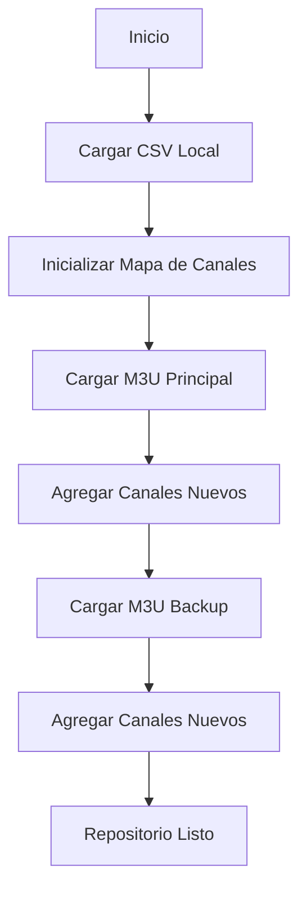

# Repositorio Híbrido - Guía Completa

## Descripción General

El **Repositorio Híbrido** es una implementación avanzada que combina múltiples fuentes de canales de televisión en una sola interfaz unificada. Esta solución permite aprovechar tanto canales curados localmente como listas remotas actualizadas automáticamente.

## Características Principales

### 🎯 Priorización Inteligente
- **CSV Local Primero**: Los canales del archivo CSV local tienen prioridad absoluta
- **M3U Remoto Secundario**: Se agregan canales de URLs M3U remotas como complemento
- **Sin Duplicados**: Eliminación automática de canales duplicados basada en ID único

### 🔄 Gestión Automática
- **Failover Robusto**: Si una fuente M3U falla, continúa con las demás disponibles
- **Actualización Inteligente**: Refresco automático según configuración de cache
- **Validación Unificada**: Todos los canales se validan independientemente de su fuente

### 📊 Monitoreo Avanzado
- **Estadísticas Detalladas**: Métricas por fuente y duplicados omitidos
- **Trazabilidad Completa**: Logs detallados de cada operación
- **Estado en Tiempo Real**: Información actualizada del repositorio

## Configuración

### Variables de Entorno

```bash
# Configuración básica del repositorio híbrido
CHANNELS_SOURCE=hybrid
CHANNELS_FILE=data/channels.csv

# URLs M3U remotas (múltiples fuentes)
M3U_URL=https://iptv-org.github.io/iptv/countries/mx.m3u
M3U_URL1=https://iptv-org.github.io/iptv/countries/ar.m3u
M3U_URL2=https://iptv-org.github.io/iptv/countries/co.m3u
M3U_URL3=https://iptv-org.github.io/iptv/countries/cl.m3u
BACKUP_M3U_URL=https://iptv-org.github.io/iptv/countries/pe.m3u

# Archivos M3U locales (fuentes adicionales)
LOCAL_M3U_LATAM1=data/latam/mexico.m3u8
LOCAL_M3U_LATAM2=data/latam/argentina.m3u8
LOCAL_M3U_LATAM3=data/latam/colombia.m3u8
LOCAL_M3U_LATAM4=data/latam/chile.m3u8
LOCAL_M3U_INDEX=data/index/premium.m3u
LOCAL_CHANNELS_CSV=data/premium/vip_channels.csv

# Configuración de cache y actualización
CACHE_CHANNELS_HOURS=6
UPDATE_INTERVAL_HOURS=4

# Configuración de validación
REMOVE_INVALID_STREAMS=true
VALIDATE_STREAMS_INTERVAL_MINUTES=15
VALIDATE_ALL_CHANNELS=true
```

### Estructura del Archivo CSV

El archivo CSV local debe seguir esta estructura:

```csv
id,name,url,logo,genre,country,language,quality
tv_canal_ejemplo,Canal Ejemplo,https://stream.ejemplo.com/live,https://logo.ejemplo.com/logo.png,Entertainment,Mexico,Spanish,HD
```

### Configuración de Múltiples Fuentes

#### URLs M3U Remotas
El sistema soporta múltiples URLs M3U remotas que se procesan en orden de prioridad:

1. **M3U_URL**: Fuente principal
2. **M3U_URL1, M3U_URL2, M3U_URL3**: Fuentes adicionales
3. **BACKUP_M3U_URL**: Fuente de respaldo

#### Archivos M3U Locales
Puedes agregar archivos M3U locales para contenido curado:

- **LOCAL_M3U_LATAM1-4**: Archivos regionales de Latinoamérica
- **LOCAL_M3U_INDEX**: Archivo índice principal
- **LOCAL_CHANNELS_CSV**: Archivo CSV de canales locales

#### Orden de Prioridad
1. **CSV Local** (máxima prioridad)
2. **Archivos M3U Locales**
3. **URLs M3U Remotas** (en orden: M3U_URL, M3U_URL1, M3U_URL2, M3U_URL3)
4. **URL de Respaldo** (mínima prioridad)

## Flujo de Operación

### 1. Inicialización



### 2. Gestión de Duplicados

- **Identificación**: Basada en el campo `id` del canal
- **Prioridad**: CSV local > M3U principal > M3U backup
- **Acción**: Los duplicados se omiten automáticamente

### 3. Validación Periódica

- **Frecuencia**: Cada 15 minutos (configurable)
- **Alcance**: Todos los canales de todas las fuentes
- **Resultado**: Activación/desactivación automática según estado

## Uso Práctico

### Inicialización del Repositorio

```javascript
import { HybridChannelRepository } from './src/infrastructure/repositories/HybridChannelRepository.js';
import { TVAddonConfig } from './src/infrastructure/config/TVAddonConfig.js';

const config = TVAddonConfig.getInstance();
const logger = console;

// Ejemplo con múltiples fuentes M3U (remotas y locales)
const m3uSources = [
  // URLs remotas
  'https://iptv-org.github.io/iptv/countries/mx.m3u',
  'https://iptv-org.github.io/iptv/countries/ar.m3u',
  'https://iptv-org.github.io/iptv/countries/co.m3u',
  // Archivos locales
  'data/latam/mexico.m3u8',
  'data/latam/argentina.m3u8',
  'data/index/premium.m3u'
];

const repository = new HybridChannelRepository(
  'data/channels.csv',
  m3uSources,
  config,
  logger
);

await repository.initialize();
```

### Obtener Estadísticas

```javascript
const stats = await repository.getRepositoryStats();
console.log('Estadísticas del Repositorio:', {
  totalChannels: stats.totalChannels,
  activeChannels: stats.activeChannels,
  deactivatedChannels: stats.deactivatedChannels,
  csvChannels: stats.csvChannels,
  remoteM3uChannels: stats.remoteM3uChannels,
  localM3uChannels: stats.localM3uChannels,
  m3uChannelsTotal: stats.m3uChannelsTotal,
  duplicatesOmitted: stats.duplicatesOmitted
});
```

### Acceso a Canales

```javascript
// Obtener todos los canales activos
const activeChannels = await repository.getAllChannels();

// Obtener todos los canales (incluyendo desactivados)
const allChannels = await repository.getAllChannelsUnfiltered();

// Obtener canales paginados
const paginatedChannels = await repository.getChannelsPaginated(0, 50);

// Buscar canales
const searchResults = await repository.searchChannels('noticias');

// Filtrar por país
const mexicanChannels = await repository.getChannelsByCountry('Mexico');
```

## Ventajas del Repositorio Híbrido

### 🎯 Para Administradores
- **Control Total**: Canales curados localmente tienen prioridad
- **Escalabilidad**: Fácil agregar nuevas fuentes M3U
- **Mantenimiento**: Gestión centralizada de múltiples fuentes
- **Monitoreo**: Estadísticas detalladas y logs completos

### 🚀 Para Usuarios Finales
- **Calidad**: Canales verificados localmente aparecen primero
- **Variedad**: Acceso a canales de múltiples fuentes
- **Confiabilidad**: Failover automático entre fuentes
- **Actualización**: Contenido siempre actualizado

### 🔧 Para Desarrolladores
- **Flexibilidad**: Interfaz unificada para múltiples fuentes
- **Extensibilidad**: Fácil agregar nuevos tipos de fuentes
- **Testabilidad**: Componentes bien separados y testeables
- **Mantenibilidad**: Código limpio siguiendo principios SOLID

## Casos de Uso Recomendados

### 1. Proveedor de IPTV Profesional
```bash
# Canales premium curados en CSV
CHANNELS_FILE=data/premium_channels.csv
# Múltiples fuentes remotas por región
M3U_URL=https://iptv-org.github.io/iptv/countries/mx.m3u
M3U_URL1=https://iptv-org.github.io/iptv/countries/ar.m3u
M3U_URL2=https://iptv-org.github.io/iptv/countries/co.m3u
M3U_URL3=https://iptv-org.github.io/iptv/countries/pe.m3u
# Archivos locales curados
LOCAL_M3U_LATAM1=data/premium_latam.m3u8
LOCAL_M3U_LATAM2=data/sports_channels.m3u8
BACKUP_M3U_URL=https://iptv-org.github.io/iptv/categories/news.m3u
```

### 2. Agregador de Contenido Regional
```bash
# Canales locales verificados
CHANNELS_FILE=data/local_channels.csv
# Fuentes regionales múltiples
M3U_URL=https://iptv-org.github.io/iptv/countries/mx.m3u
M3U_URL1=https://iptv-org.github.io/iptv/languages/spa.m3u
M3U_URL2=https://iptv-org.github.io/iptv/categories/general.m3u
# Archivos locales por región
LOCAL_M3U_LATAM1=data/latam1.m3u8
LOCAL_M3U_LATAM2=data/latam2.m3u8
LOCAL_M3U_LATAM3=data/latam3.m3u8
LOCAL_M3U_LATAM4=data/latam4.m3u8
BACKUP_M3U_URL=https://iptv-org.github.io/iptv/languages/spa.m3u
```

### 3. Servicio de Pruebas y Desarrollo
```bash
# Canales de prueba controlados
CHANNELS_FILE=data/test_channels.csv
# Múltiples fuentes de prueba
M3U_URL=https://iptv-org.github.io/iptv/categories/kids.m3u
M3U_URL1=https://iptv-org.github.io/iptv/categories/education.m3u
M3U_URL2=https://iptv-org.github.io/iptv/categories/music.m3u
# Archivos locales de desarrollo
LOCAL_M3U_INDEX=data/index.m3u
LOCAL_CHANNELS_CSV=data/channels.csv
```

### 4. Configuración Completa Multi-Región
```bash
# Configuración completa con todas las fuentes
CHANNELS_SOURCE=hybrid
CHANNELS_FILE=data/channels.csv

# URLs remotas por país
M3U_URL=https://iptv-org.github.io/iptv/countries/mx.m3u
M3U_URL1=https://iptv-org.github.io/iptv/countries/ar.m3u
M3U_URL2=https://iptv-org.github.io/iptv/countries/co.m3u
M3U_URL3=https://iptv-org.github.io/iptv/countries/pe.m3u

# Archivos locales especializados
LOCAL_M3U_LATAM1=data/latam1.m3u8
LOCAL_M3U_LATAM2=data/latam2.m3u8
LOCAL_M3U_LATAM3=data/latam3.m3u8
LOCAL_M3U_LATAM4=data/latam4.m3u8
LOCAL_M3U_INDEX=data/index.m3u
LOCAL_CHANNELS_CSV=data/channels.csv

# Respaldo general
BACKUP_M3U_URL=https://iptv-org.github.io/iptv/languages/spa.m3u
```

## Troubleshooting

### Problemas Comunes

#### 1. No se cargan canales M3U
**Síntoma**: Solo aparecen canales del CSV
**Solución**:
```bash
# Verificar URLs M3U
curl -I https://iptv-org.github.io/iptv/countries/mx.m3u

# Revisar logs
node scripts/test-hybrid-repository.js
```

#### 2. Muchos duplicados omitidos
**Síntoma**: Estadísticas muestran muchos duplicados
**Solución**:
- Revisar IDs en el archivo CSV
- Verificar formato de URLs M3U
- Considerar usar fuentes M3U más específicas

#### 3. Validación lenta
**Síntoma**: Proceso de validación toma mucho tiempo
**Solución**:
```bash
# Reducir frecuencia de validación
VALIDATE_STREAMS_INTERVAL_MINUTES=30

# Validar por muestras en lugar de todos
VALIDATE_ALL_CHANNELS=false
```

### Logs de Diagnóstico

```bash
# Ejecutar prueba completa
node scripts/test-hybrid-repository.js

# Ejecutar validación por lotes
node scripts/test-batch-validation.js

# Verificar configuración
node -e "console.log(require('./src/infrastructure/config/TVAddonConfig.js').TVAddonConfig.getInstance().getAll())"
```

## Mejores Prácticas

### 📋 Gestión de Canales CSV
1. **IDs Únicos**: Usar identificadores descriptivos y únicos
2. **Metadatos Completos**: Incluir toda la información disponible
3. **URLs Verificadas**: Probar streams antes de agregar al CSV
4. **Organización**: Agrupar por categorías o regiones

### 🔗 Selección de Fuentes M3U
1. **Fuentes Confiables**: Usar URLs de proveedores reconocidos
2. **Especificidad**: Preferir listas específicas sobre generales
3. **Actualización**: Verificar frecuencia de actualización de las fuentes
4. **Backup**: Siempre configurar una URL de respaldo

### 🌐 Gestión de Múltiples Fuentes
1. **Priorización**: Configurar fuentes en orden de confiabilidad
2. **Diversificación**: Usar fuentes de diferentes proveedores
3. **Especialización**: Asignar fuentes específicas por región/categoría
4. **Redundancia**: Mantener múltiples fuentes para contenido crítico
5. **Archivos Locales**: Usar para contenido curado y de alta calidad
6. **Monitoreo**: Verificar regularmente el estado de todas las fuentes

### 📁 Organización de Archivos Locales
1. **Nomenclatura**: Usar nombres descriptivos (latam1, latam2, etc.)
2. **Contenido**: Especializar cada archivo por región o categoría
3. **Mantenimiento**: Actualizar regularmente los archivos locales
4. **Validación**: Verificar integridad antes de usar
5. **Backup**: Mantener copias de seguridad de archivos críticos

### ⚡ Optimización de Rendimiento
1. **Cache Inteligente**: Ajustar `CACHE_CHANNELS_HOURS` según necesidades
2. **Validación Eficiente**: Balancear frecuencia vs. recursos
3. **Concurrencia**: Ajustar límites según capacidad del servidor
4. **Monitoreo**: Revisar regularmente estadísticas y logs
5. **Carga Balanceada**: Distribuir carga entre múltiples fuentes
6. **Failover Rápido**: Configurar timeouts apropiados para cambio de fuente

## Conclusión

El Repositorio Híbrido representa una solución robusta y escalable para la gestión de canales de televisión desde múltiples fuentes. Su diseño modular y configuración flexible lo hacen ideal para una amplia variedad de casos de uso, desde servicios profesionales hasta implementaciones de desarrollo.

La combinación de canales curados localmente con fuentes remotas dinámicas proporciona el equilibrio perfecto entre control de calidad y variedad de contenido, mientras que las características de validación automática aseguran una experiencia de usuario consistente y confiable.